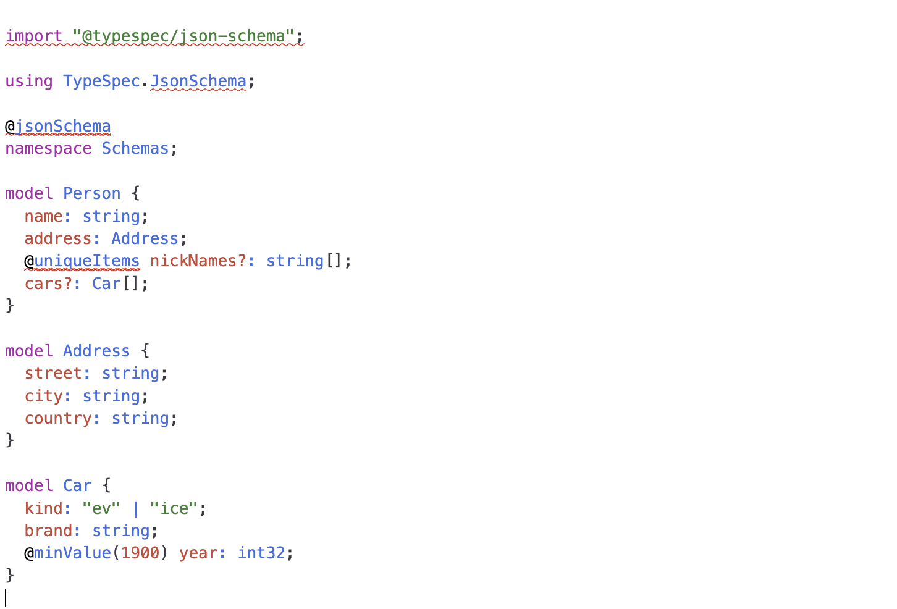

# Codemirror Typespec Demo

This project is a demo of useing [Typespec](https://github.com/microsoft/typespec) with [Codemirror](https://github.com/codemirror/codemirror6).

A Node.js server is running the Typespec compiler language server, connected via [codemirror-languageserver](https://github.com/FurqanSoftware/codemirror-languageserver), because the [@typespec/compiler](https://github.com/microsoft/typespec/tree/main/packages/compiler) does not support browser environments.



## preview

```bash
pnpm install

pnpm run dev
```
